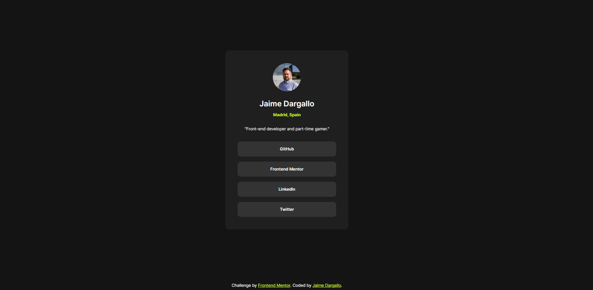

# Frontend Mentor - Social links profile solution 🚀

## Welcome! 👋

Thank you for exploring this front-end coding challenge.

This repository contains my solution to the Social Links challenge on Frontend Mentor. Frontend Mentor challenges are fantastic for honing your coding skills by building realistic projects.

## Table of Contents

- [Overview](#overview)
- [The Challenge](#the-challenge)
- [Screenshot](#screenshot)
- [Links](#links)
- [My Process](#my-process)
- [Built With](#built-with)
- [What I Learned](#what-i-learned)
- [Continued Development](#continued-development)
- [Useful Resources](#useful-resources)
- [Author](#author)
- [Acknowledgments](#acknowledgments)

## Overview

### The Challenge

Users should be able to:

- See hover and focus states for all interactive elements on the page

## Screenshot

## Links

- [Solution URL](https://github.com/jaimedargallo/social-links)
- [Live Site URL](https://social-links-zeta-nine.vercel.app/)

## My Process

I approached this project using a mobile-first workflow and implemented the design using Semantic HTML5 markup and CSS custom properties. Below is a summary of the tools and methodologies I used:

### Built With

- Semantic HTML5 markup
- CSS custom properties
- Flexbox
- CSS Grid
- Mobile-first workflow
- Styled Components - For styles

## What I Learned

In this project, I reinforced my understanding of various concepts, including:

## Continued Development

Moving forward, I aim to focus on refining and perfecting the following areas:

## Useful Resources

- [Git Commit Best Practices](https://midu.dev/buenas-practicas-escribir-commits-git/) -

## Author

- [Frontend Mentor](https://www.frontendmentor.io/profile/jaimedargallo)
- [Twitter](https://twitter.com/JaimeDargallo)
- [Github](https://github.com/jaimedargallo)
